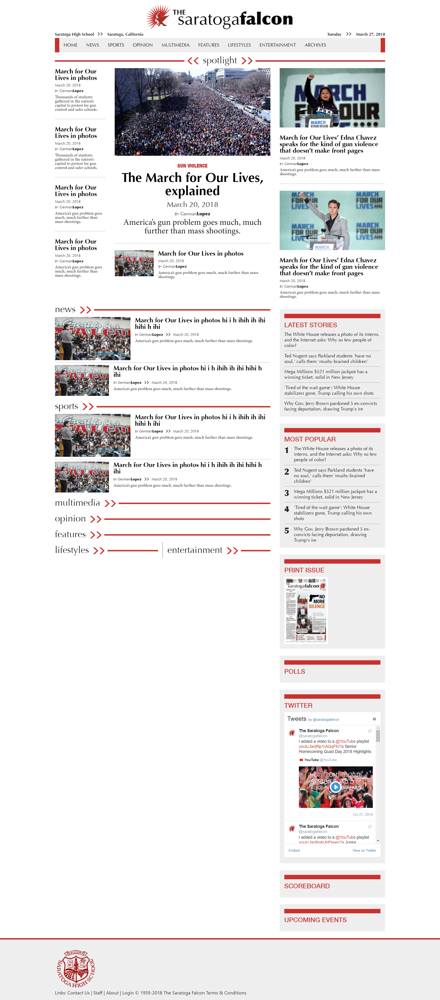

# The Saratoga Falcon Website
*(This is a work in progress)*

This is a static website created as a high-fidelity web design for the saratogafalcon.org, the website for Saratoga High School's newspaper located in Saratoga, California. Next steps are to finalize the design and translate it to a Drupal custom theme to be implement on the live site.

## Technologies:
* HTML
* CSS
* JavaScript

## Installation:
Run `git clone https://github.com/kyuwonk/TheSaratogaFalcon.git` then open `index.html` in a browser.

## Snapshot:

